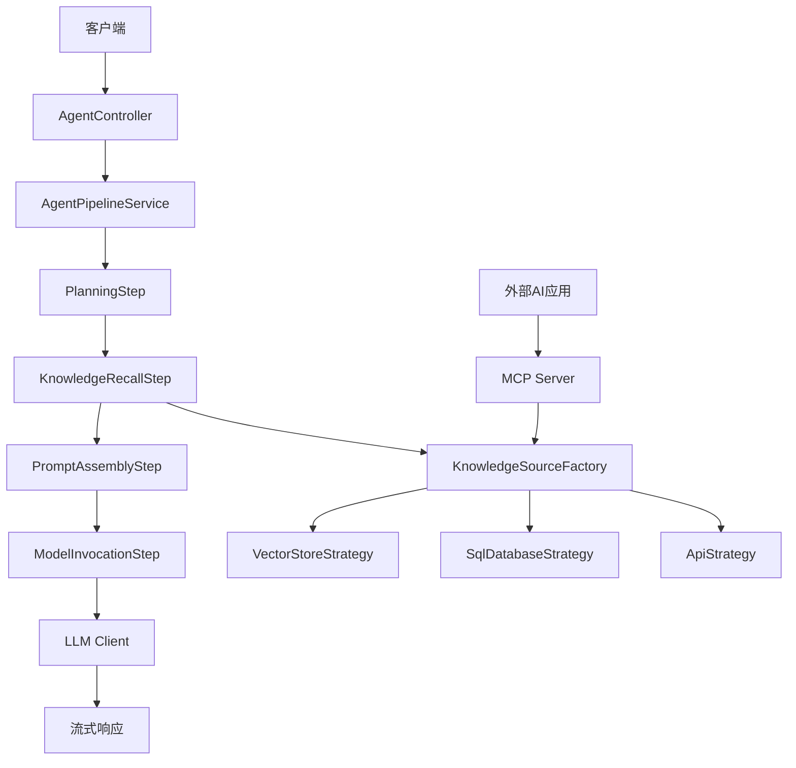

# Spring Boot 知识 Agent

[](https://www.oracle.com/java/)
[](https://spring.io/projects/spring-boot)
[](https://maven.apache.org/)
[](LICENSE)

## 📝 项目概述

Spring Boot 知识 Agent 是一个基于领域驱动设计的智能知识检索和问答系统。它采用责任链模式实现四步处理流程：搜索规划 → 知识召回 → Prompt 拼接 → 模型调用，支持多种数据源的知识检索和实时流式响应。

### 🚀 核心特性

- **🏗️ 领域驱动架构**：多模块单体设计，高内聚低耦合
- **🔗 责任链处理**：可扩展的四步处理流程
- **📊 多源知识检索**：支持向量存储、SQL数据库、API等多种数据源
- **🌊 双向流式处理**：实时进度推送和LLM响应流转发
- **🔌 MCP协议支持**：标准化AI生态互操作性
- **⚡ 异步高性能**：响应式与Servlet栈混合架构

## 🏛️ 系统架构

### 模块结构

```
agent-project/
├── agent-app/          # 可执行应用模块
├── agent-core/         # 核心基础模块
├── agent-pipeline/     # 核心流程模块
├── agent-knowledge/    # 知识管理模块
└── agent-mcp/         # MCP协议模块
```

### 架构图



### 设计模式

| 模式 | 应用场景 | 优势 |
|------|----------|------|
| **责任链模式** | 四步处理流程 | 可扩展、低耦合 |
| **策略模式** | 多数据源知识检索 | 运行时切换、开闭原则 |
| **建造者模式** | AgentContext构建 | 流畅API、参数验证 |
| **外观模式** | 统一客户端接口 | 简化使用、隐藏复杂性 |

## 🛠️ 技术栈

### 核心框架
- **Spring Boot 3.x** - 应用框架
- **Spring MVC** - Web层
- **Spring WebFlux** - 响应式客户端
- **Maven** - 构建工具

### 流式处理
- **Server-Sent Events (SSE)** - 服务端推送
- **WebClient** - 响应式HTTP客户端
- **DataBufferUtils** - 流数据桥接

### 协议与标准
- **JSON-RPC 2.0** - MCP协议基础
- **WebSocket** - MCP通信
- **JSON Schema** - API规范

## 🚦 快速开始

### 环境要求

- Java 17+
- Maven 3.6+
- IDE支持（推荐IntelliJ IDEA）

### 安装与运行

1. **克隆项目**
```bash
git clone <repository-url>
cd rag
```

2. **构建项目**
```bash
./mvnw clean install
```

3. **配置环境**
```bash
# 复制配置模板
cp src/main/resources/application.properties.template src/main/resources/application.properties

# 编辑配置文件，设置必要的API密钥和数据库连接
```

4. **启动应用**
```bash
./mvnw spring-boot:run
```

5. **验证服务**
```bash
curl http://localhost:8080/actuator/health
```

### 配置说明

```properties
# LLM 配置
agent.llm.api-key=${LLM_API_KEY}
agent.llm.base-url=${LLM_BASE_URL}
agent.llm.model=${LLM_MODEL:gpt-3.5-turbo}

# 向量数据库配置
agent.vector.url=${VECTOR_DB_URL}
agent.vector.api-key=${VECTOR_DB_API_KEY}

# 数据库配置
spring.datasource.url=${DATABASE_URL}
spring.datasource.username=${DATABASE_USERNAME}
spring.datasource.password=${DATABASE_PASSWORD}

# MCP 配置
agent.mcp.enabled=${MCP_ENABLED:true}
agent.mcp.port=${MCP_PORT:8081}
```

## 📖 API 文档

### 核心端点

#### 1. 问答接口

```http
POST /api/v1/chat
Content-Type: application/json

{
    "query": "用户问题",
    "context": {
        "sessionId": "会话ID",
        "userId": "用户ID"
    }
}
```

#### 2. 流式问答接口

```http
GET /api/v1/chat/stream?query=用户问题
Accept: text/event-stream
```

**响应格式：**
```
event: planning
data: {"status": "planning", "message": "正在制定搜索计划..."}

event: knowledge
data: {"status": "knowledge", "chunks": [...]}

event: response
data: {"status": "response", "content": "AI回答内容"}

event: complete
data: {"status": "complete"}
```

#### 3. 知识检索接口

```http
POST /api/v1/knowledge/retrieve
Content-Type: application/json

{
    "strategy": "vector_store",
    "query": "检索查询",
    "parameters": {
        "topK": 5,
        "threshold": 0.7
    }
}
```

### MCP 工具接口

#### knowledge_retriever 工具

```json
{
    "method": "tools/call",
    "params": {
        "name": "knowledge_retriever",
        "arguments": {
            "query": "搜索查询",
            "source": "vector_store",
            "limit": 10
        }
    }
}
```

## 🔧 开发指南

### 添加新的处理步骤

1. 创建实现 `PipelineStep` 接口的类
2. 使用 `@Service` 和 `@Order` 注解
3. 无需修改现有代码

```java
@Service
@Order(50)
public class CustomProcessingStep implements PipelineStep {
    
    @Override
    public void process(AgentContext context) {
        // 处理逻辑
    }
    
    @Override
    public void setNext(PipelineStep nextStep) {
        this.nextStep = nextStep;
    }
}
```

### 添加新的知识源

1. 实现 `KnowledgeSourceStrategy` 接口
2. 使用命名的 `@Service` 注解
3. 工厂会自动注册新策略

```java
@Service("custom_source")
public class CustomKnowledgeStrategy implements KnowledgeSourceStrategy {
    
    @Override
    public List<KnowledgeChunk> retrieve(PlanDetail planDetail) {
        // 检索逻辑
        return chunks;
    }
    
    @Override
    public String getStrategyName() {
        return "custom_source";
    }
}
```

### 扩展MCP工具

1. 在 `McpToolProvider` 中添加新工具定义
2. 实现工具执行逻辑
3. 更新JSON Schema规范

## 🧪 测试

### 运行测试

```bash
# 运行所有测试
./mvnw test

# 运行特定模块测试
./mvnw test -pl agent-knowledge

# 运行集成测试
./mvnw test -Dtest=**/*IntegrationTest
```

### 测试覆盖率

```bash
./mvnw jacoco:report
```

### 测试策略

- **单元测试**：模块内组件测试
- **集成测试**：模块间交互测试
- **端到端测试**：完整流程测试
- **性能测试**：流式处理性能测试

## 📊 监控与运维

### 健康检查

```bash
# 基础健康检查
curl http://localhost:8080/actuator/health

# 详细健康信息
curl http://localhost:8080/actuator/health/detailed
```

### 指标监控

应用暴露以下Prometheus指标：

- `agent_requests_total` - 请求总数
- `agent_processing_duration` - 处理耗时
- `agent_knowledge_retrieval_duration` - 知识检索耗时
- `agent_stream_connections` - 活跃流连接数

### 日志配置

```properties
# 应用日志级别
logging.level.com.example.agent=INFO

# 请求追踪
logging.pattern.console=%d{yyyy-MM-dd HH:mm:ss} [%thread] %-5level [%X{requestId}] %logger{36} - %msg%n
```

## 🔐 安全考虑

### API配置

- 简化的API密钥配置
- 环境变量支持
- 多API提供商支持

### 数据保护

- 输入数据验证
- 输出内容过滤
- 传输数据安全

### 防护措施

- 请求频率限制
- 输入验证
- SQL注入防护

## 🚀 部署

### Docker 部署

```dockerfile
FROM openjdk:17-jre-slim

COPY target/agent-app-*.jar app.jar

EXPOSE 8080 8081

ENTRYPOINT ["java", "-jar", "/app.jar"]
```

### Kubernetes 部署

参考 `k8s/` 目录下的配置文件。

### 环境配置

| 环境 | 描述 | 配置文件 |
|------|------|----------|
| 开发 | 本地开发环境 | `application-dev.properties` |
| 测试 | 测试环境 | `application-test.properties` |
| 生产 | 生产环境 | `application-prod.properties` |

## 🤝 贡献指南

1. Fork 项目
2. 创建特性分支 (`git checkout -b feature/AmazingFeature`)
3. 提交更改 (`git commit -m 'Add some AmazingFeature'`)
4. 推送到分支 (`git push origin feature/AmazingFeature`)
5. 打开 Pull Request

### 代码规范

- 遵循Google Java Style Guide
- 使用CheckStyle检查代码风格
- 编写完整的Javadoc注释
- 保持测试覆盖率 > 80%

## 📝 许可证

本项目基于 MIT 许可证 - 查看 [LICENSE](LICENSE) 文件了解详情。

## 🆘 支持

如遇问题，请：

1. 查看 [FAQ](docs/FAQ.md)
2. 搜索 [已知问题](../../issues)
3. 创建新的 [Issue](../../issues/new)

## 📚 相关资源

- [设计文档](ragAgentPrd.md)
- [API文档](docs/api.md)
- [部署指南](docs/deployment.md)
- [MCP协议规范](https://modelcontextprotocol.io/)

---

**Made with ❤️ by the Agent Team**